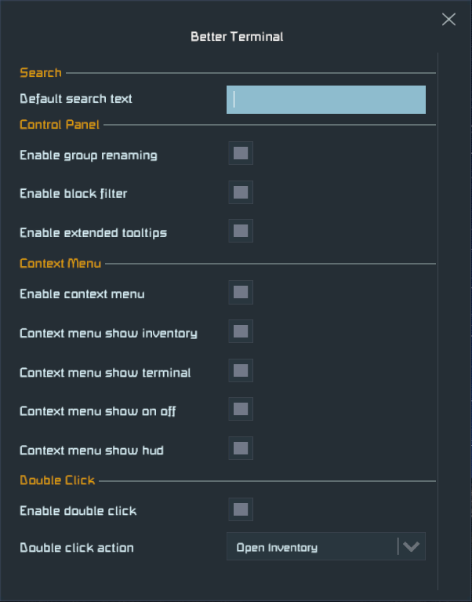
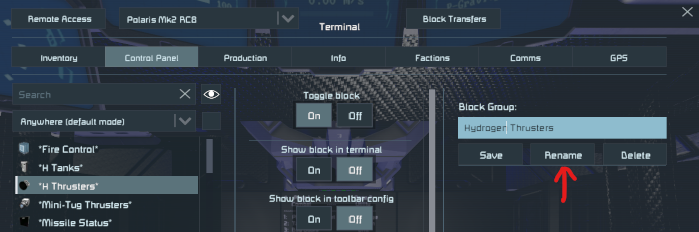

# Better Terminal

Terminal UI improvements for Space Engineers.

For support please [join the SE Mods Discord](https://discord.gg/PYPFPGf3Ca).

Please consider supporting my work on [Patreon](https://www.patreon.com/semods) or one time via [PayPal](https://www.paypal.com/paypalme/vferenczi/).

*Thank you and enjoy!*

## Prerequisites

- [Space Engineers](https://store.steampowered.com/app/244850/Space_Engineers/)
- [Plugin Loader](https://github.com/sepluginloader/SpaceEngineersLauncher)

## Installation

1. Install Plugin Loader's [Space Engineers Launcher](https://github.com/sepluginloader/SpaceEngineersLauncher)
2. Run the game
3. In the new **Plugins** menu add the "Better Terminal" plugin
4. Apply and restart the game as requested

## Configuration

Press `Ctrl-Alt-/` while in-game and not in the GUI. It will open the list of
configurable plugins. Select **Better Terminal** from the list to configure this plugin.
Alternatively you can open the settings by double-clicking on this plugin in the Plugins
dialog of Plugin Loader, then clicking **Settings** in the dialog opened.

The configuration allows for setting a default search text, which is useful if you work
with groups and block which contain the same substring in their name, for example the
ship's or station's name. It also allows for turning each feature ON/OFF.

The configuration can be changed anytime without having to restart the game. The
transpiler patches are always loaded, but they provided the same functionality as
the original game if it is disabled.

## Features

### Control Panel

#### Rename group

There is a new **Rename** button under the group name. Select the group to rename,
edit the name in the group name text box, then click Rename. Any block toolbars
referencing the group will be updated automatically, so there will be no broken slots.

#### Block filter

There is a new dropdown below the block search field. 
You can filter the block list for various common situations,
by any named group or by block type. The default filter mode
is identical to the default SE behavior except of fixing the
bug with initial scroll position of the block list.

The block filter is reset to default mode each time you open
the Terminal UI to prevent confusion.

#### Default block names

There is a new checkbox right next to the block filter dropdown.
It toggles showing the default block names instead of the player defined ones.
This is really useful to find blocks by their type, regardless of how they were renamed.

The default name checkbox is cleared each time you open the Terminal UI to prevent confusion.

## Troubleshooting

Should you have any issues using this plugin, then please either submit a ticket here
on GitHub or report the issue in the `#bug-reports` channel of the [SE Mods Discord](https://discord.gg/PYPFPGf3Ca). 

## Want to know more?

- [SE Mods Discord](https://discord.gg/PYPFPGf3Ca) FAQ, Troubleshooting, Support, Bug Reports, Discussion
- [Plugin Loader Discord](https://discord.gg/6ETGRU3CzR) Everything about plugins
- [YouTube Channel](https://www.youtube.com/channel/UCc5ar3cW9qoOgdBb1FM_rxQ)
- [Source code](https://github.com/viktor-ferenczi/toolbar-manager)
- [Bug reports](https://discord.gg/x3Z8Ug5YkQ)

## Credits

### Patreon Supporters

_in alphabetical order_

#### Admiral level
- BetaMark
- Casinost
- Mordith - Guardians SE
- Robot10
- wafoxxx

#### Captain level
- Diggz
- jiringgot
- Jimbo
- Kam Solastor
- lazul
- Linux123123
- Lotan
- Lurking StarCpt
- NeonDrip
- NeVaR
- opesoorry

#### Testers
- Avaness
- mkaito

### Creators
- avaness - Plugin Loader
- Fred XVI - Racing maps
- Kamikaze - M&M mod
- LTP
- Mordith - Guardians SE
- Mike Dude - Guardians SE
- SwiftyTech - Stargate Dimensions

**Thank you very much for all your support!**