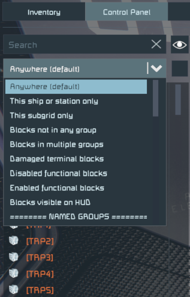
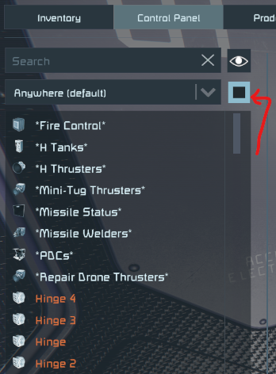

# Better Terminal

Terminal UI improvements for Space Engineers.

## Prerequisites

- [Space Engineers](https://store.steampowered.com/app/244850/Space_Engineers/)
- [Plugin Loader](https://github.com/sepluginloader/SpaceEngineersLauncher)

## Installation

1. Install Plugin Loader's [Space Engineers Launcher](https://github.com/sepluginloader/SpaceEngineersLauncher)
2. Run the game
3. In the new **Plugins** menu add the "Better Terminal" plugin
4. Apply and restart the game as requested

## Features

### Control Panel

#### Block filters

There is a new dropdown below the block search field. It allows to select predefined filters useful in various common situations.

#### Showing default block names

There is a new checkbox below the "Show all blocks" one.
While it is checked the default blocknames are shown instead of the player defined ones.
It is useful to find blocks by their type, regardless of their name.
This checkbox is cleared each time you open the Terminal UI.

