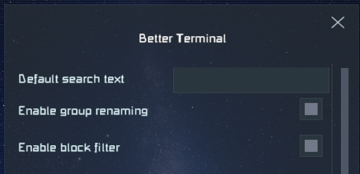

# Better Terminal

Terminal UI improvements for Space Engineers.

For support please [join the SE Mods Discord](https://discord.gg/PYPFPGf3Ca).

Please consider supporting my work on [Patreon](https://www.patreon.com/semods) or one time via [PayPal](https://www.paypal.com/paypalme/vferenczi/).

*Thank you and enjoy!*

## Prerequisites

- [Space Engineers](https://store.steampowered.com/app/244850/Space_Engineers/)
- [Pulsar](https://github.com/SpaceGT/Pulsar)

## Installation

1. Install Pulsar's [Space Engineers Launcher](https://github.com/sepluginloader/SpaceEngineersLauncher)
2. Run the game
3. In the new **Plugins** menu add the "Better Terminal" plugin
4. Apply and restart the game as requested

## Features

### Control Panel

#### Renaming groups

There is a new **Rename button** under the group name. 

Select the group to rename, edit the name in the group name text box, then click Rename.
Any block toolbars referencing the group will be updated automatically, 
so there will be no broken slots.

#### Block filter

There is a **dropdown list** below the block search field.
You can filter the block list for various **common situations**,
by **block group** and by **block type**. 

The default filter mode is identical to the default SE behavior
except of fixing the bug with initial scroll position of the block list.

_The block filter is reset to default mode each time you open
the Terminal UI to prevent confusion._

#### Default block names

There is a **checkbox** right next to the block filter dropdown.

It **toggles showing the default block names** instead of the player defined custom ones.
This is really useful to find blocks by their type, regardless of how they were renamed.

Enabling this feature will **not** rename your blocks back to their default name.
All it does is changing the list to show the default names until it is enabled.
You can still see the custom block names in the tooltips as you hover over the
blocks in the list.

_The default name checkbox is cleared each time you open the Terminal UI to prevent confusion._

#### Block context menu

**Right-clicking** a block in the Terminal list opens a **context menu** with quick actions
for that block, without having to scroll through its settings panel.

The menu can include (each item can be toggled individually in the configuration):

- **Open Inventory** — switch straight to the inventory screen for this block _(blocks with inventory only)_
- **Turn ON / Turn OFF** — toggle the block on or off _(functional blocks only)_
- **Show in Terminal / Hide from Terminal** — control whether the block appears in the list
- **Show on HUD / Hide from HUD** — toggle the block's HUD marker
- **Enable / Disable Use Conveyor** — toggle conveyor connection _(reactors, refineries, gas generators, etc.)_
- **Block actions** — all relevant terminal actions for the block, sorted alphabetically. Only the actions that make sense for the block's current state are shown (e.g. "Turn On" is hidden when the block is already on).
- **Toggles** — additional on/off properties exposed by the block or its mods.

#### Double-click action

You can configure a **double-click shortcut** that triggers whenever you double-click a block
in the Terminal list. Available actions:

| Setting | What happens |
|---|---|
| None _(default)_ | No action |
| Open Inventory | Opens the inventory screen for that block |
| Toggle ON/OFF | Turns the block on or off |
| Toggle Show on HUD | Toggles the block's HUD marker |
| Toggle Terminal | Shows or hides the block in the Terminal list |

The double-click action is configured in the plugin settings (see [Configuration](#configuration) below).

<!-- TODO: add screenshot of the double-click setting in the config dialog -->

#### Faster list editing with double-click

Several block-specific terminal panels now support **double-clicking items** in their lists as a
shortcut for the most common action, instead of having to click the item and then press a button:

| Block | List | Double-click does |
|---|---|---|
| **Conveyor Sorter** | Available filters | Adds the item to active filters |
| **Conveyor Sorter** | Active filters | Removes the item |
| **Jump Drive** | GPS entries / Beacons | Selects the entry as jump target |
| **Jump Drive** | Selected target | Removes the selected target |
| **Event Controller** | Available blocks | Adds the block to the selection |
| **Event Controller** | Selected blocks | Removes the block |
| **Turret Control Block** | Available tools | Adds the tool to the selection |
| **Turret Control Block** | Selected tools | Removes the tool |

## Configuration

Press `Ctrl-Alt-/` while in-game and not in the GUI. It will open the list of
configurable plugins. Select **Better Terminal** from the list to configure this plugin.
Alternatively you can open the settings by double-clicking on this plugin in the Plugins
dialog of Pulsar, then clicking **Settings** in the dialog opened.

The configuration allows for:

- Setting a **default search text**, which is useful if you work with blocks and groups
  that share a common part of their name (e.g. the ship's or station's name).
- **Turning each feature ON/OFF** individually, including each context menu item category.
- Choosing the **double-click action** for block list items.

The configuration can be changed at any time without restarting the game.

## Troubleshooting

Should you have any issues using this plugin, then please either submit a ticket here
on GitHub or report the issue in the `#bug-reports` channel of the [SE Mods Discord](https://discord.gg/PYPFPGf3Ca). 

## Want to know more?

- [SE Mods Discord](https://discord.gg/PYPFPGf3Ca) FAQ, Troubleshooting, Support, Bug Reports, Discussion
- [Pulsar Discord](https://discord.gg/z8ZczP2YZY) Everything about plugins
- [Source code](https://github.com/viktor-ferenczi/se-better-terminal)
- [Bug reports](https://discord.gg/x3Z8Ug5YkQ)

## Credits

### Patreon Supporters

_in alphabetical order_

#### Admiral level
- BetaMark
- Casinost
- Mordith - Guardians SE
- Robot10
- wafoxxx

#### Captain level
- CaptFacepalm
- Diggz
- jiringgot
- Jimbo
- Kam Solastor
- lazul
- Linux123123
- Lotan
- Lurking StarCpt
- NeonDrip
- NeVaR
- opesoorry

#### Testers
- Avaness
- mkaito
- Unruly

### Creators
- Space - Pulsar
- avaness - Plugin Loader
- Fred XVI - Racing maps
- Kamikaze - M&M mod
- LTP
- Mordith - Guardians SE
- Mike Dude - Guardians SE
- SwiftyTech - Stargate Dimensions

**Thank you very much for all your support!**